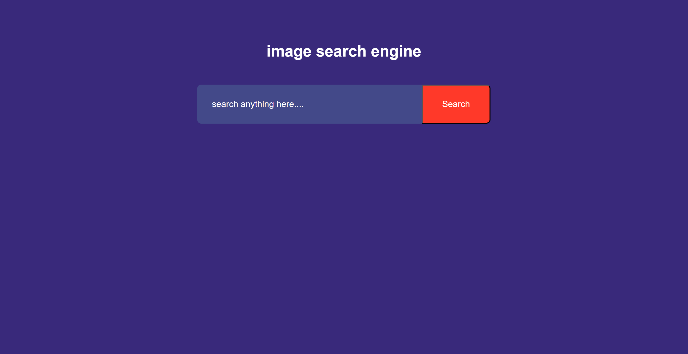
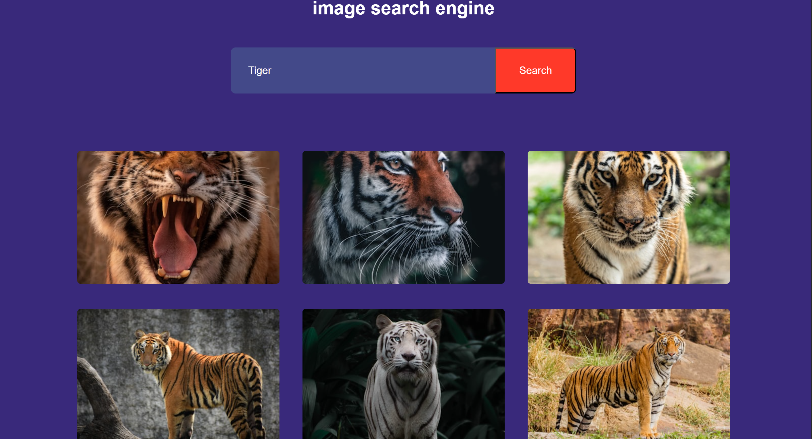

# Image Search App

A simple web application that allows users to search for images using keywords and displays the results dynamically.

## Features

- Search for images by keyword
- Display search results as a gallery
- Clean and responsive user interface

## Screenshots

### Search Page

<p align="center">
  
  <br>
  <em>Figure 1: Image Search input and button</em>
</p>

### Result Page

<p align="center">
  
  <br>
  <em>Figure 2: Image results displayed in gallery format</em>
</p>

## Installation

1. Clone the repository:

   ```bash
   git clone https://github.com/rashi311/Image_Search_App.git
   cd Image_Search_App

2. Open the index.html file in your preferred browser.

## Usage

- Enter a keyword in the search box.  
- Click the **Search** button.  
- View the image results displayed below.

## Technologies Used

- HTML  
- CSS  
- JavaScript  
- Unsplash API

## Folder Structure

Image_Search_App/
├── Images/ # Screenshots and assets
├── index.html # Main HTML file
├── style.css # Stylesheet
├── script.js # JavaScript file handling search functionality
└── README.md # Project documentation


